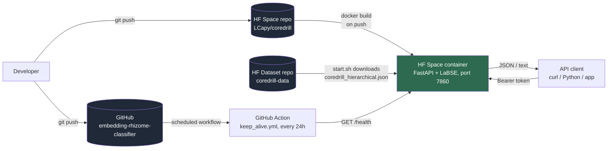
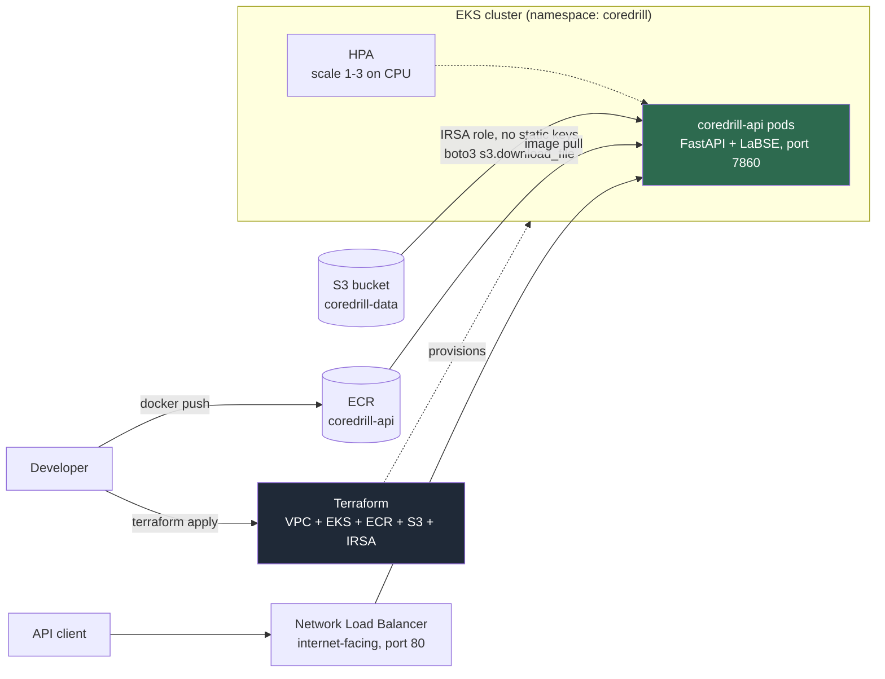
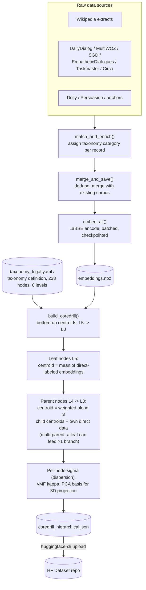
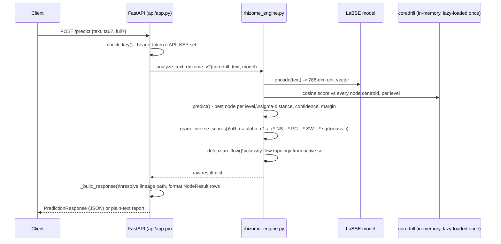
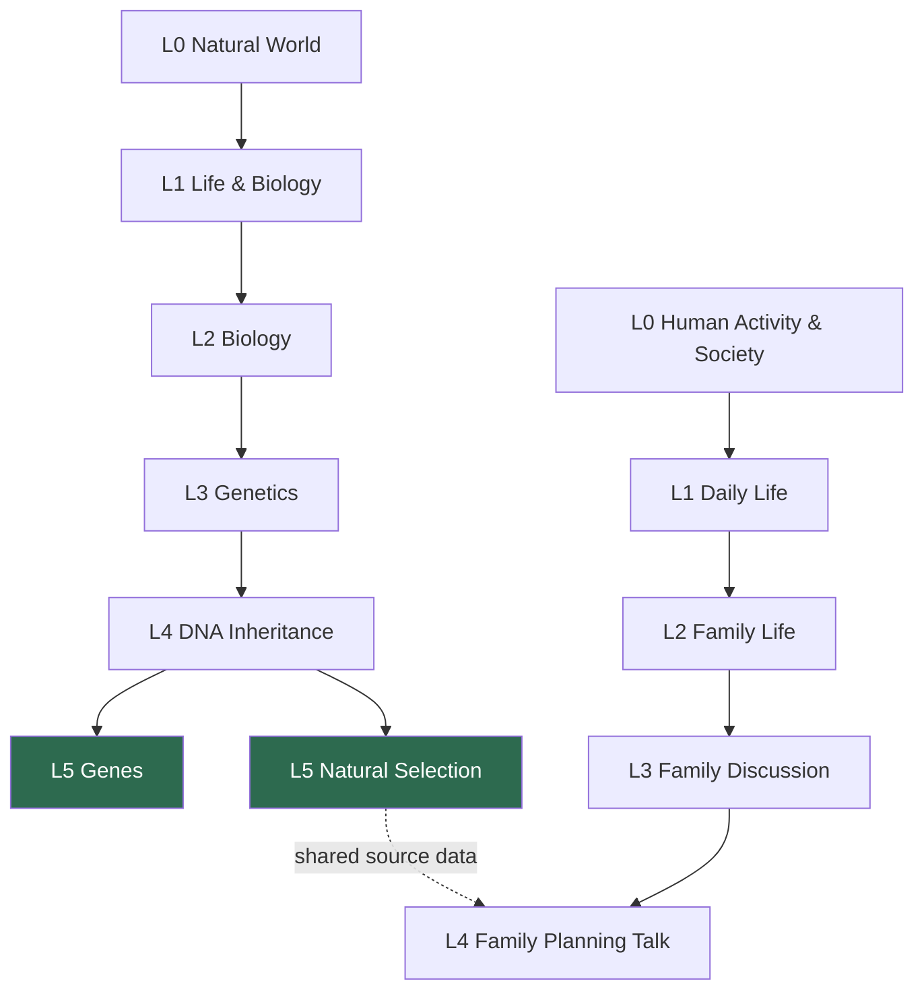

# Architecture

Five views of the same system: how the current deployment fits together, the
target self-hosted deployment on EKS, how the offline build pipeline turns
raw text into `coredrill_hierarchical.json`, what happens on a single
`/predict` call, and what the taxonomy graph itself looks like. See
[`docs/study_v5.md`](study_v5.md) for the math behind the scoring formulas
referenced here, [`docs/free_deployment.md`](free_deployment.md) for the
Hugging Face deploy guide, and [`infra/README.md`](../infra/README.md) for
the EKS deploy guide.

---

## 1. Deployment topology (current: Hugging Face)

Three repos, one running service. Code and docs live on GitHub; the
running API lives on a Hugging Face Space; the large coredrill file
lives on a separate HF Dataset repo so it never has to go through git.

Notes:
- The Docker image bakes in the LaBSE model weights at build time (`RUN python -c
  "...SentenceTransformer('sentence-transformers/LaBSE')"`) so cold starts don't
  re-download ~1.5 GB of weights.
- `coredrill_hierarchical.json` (the taxonomy centroids, tens of MB) stays out of
  git entirely and is pulled at container start from an HF Dataset repo, keyed by
  the `HF_DATASET_REPO` / `HF_DATASET_FILE` / `HF_TOKEN` Space secrets.
- The free HF Space tier sleeps after 48h idle; `keep_alive.yml` pings `/health`
  every 24h so it never does.

---

## 2. Deployment topology (target: self-hosted on EKS)

Same container image and API, no external hosting dependency. All AWS
resources are provisioned by [`infra/terraform`](../infra/terraform); the
Deployment/Service/HPA live in [`infra/k8s`](../infra/k8s). Details and exact
commands: [`infra/README.md`](../infra/README.md).

Notes:
- No Hugging Face dependency at runtime: the image is pulled from ECR, and
  `coredrill_hierarchical.json` is pulled from S3 using the pod's IRSA role
  (`COREDRILL_S3_URI`, checked before `HF_DATASET_REPO` in `start.sh`) - so
  the same image serves both the HF Space and EKS.
- Nodes are CPU-only (`t3.large`), matching the current HF Space's resource
  profile; the HPA scales pods 1-3 on CPU utilization once `metrics-server`
  is installed.
- No TLS/custom domain or CI/CD wiring yet - the NLB is plain HTTP on port
  80. See "Next steps" in `infra/README.md`.

---

## 3. Offline build pipeline

This runs locally, not on the Space. Its only output that matters at
serve time is `coredrill_hierarchical.json`.

Notes:
- `build_coredrill()` walks the taxonomy from the deepest level (L5) up to the
  root (L0). Leaf centroids come directly from labeled embeddings; every
  internal node's centroid is a source-balanced blend of its children plus
  whatever direct data it has.
- "Rhizome" refers to the multi-parent step: a single sentence's embedding can
  contribute to more than one branch of the taxonomy (e.g. a sentence can
  support both a biology node and a daily-life node), so the graph is a DAG,
  not a strict tree.

---

## 4. Request flow (`POST /predict`)

Notes:
- The model and the coredrill JSON are both loaded lazily on first request and
  cached as process globals (`_get_model()`, `_get_coredrill()`) - the first
  request after a cold start is slow, every one after is fast.
- `gram_inverse_scores()` is the actual winner-selection step: cosine
  similarity alone (`s_i`) is necessary but not sufficient. A node also needs
  neighborhood support (`NS`, do semantically nearby nodes agree), path
  coherence (`PC`, do its taxonomy ancestors agree), and enough specificity
  (`SW`, prefer tight low-sigma territories over diffuse ones) to win.
- `full=true` additionally returns the top-40 ranked table instead of only the
  active overlap set.

---

## 5. Taxonomy structure (illustrative subgraph)

The real taxonomy has 238 nodes across 6 levels (L0-L5); this is a small
slice showing the multi-parent shape described above - `Natural Selection`
feeds both the biology branch and, indirectly, the daily-life branch through
shared source sentences.

